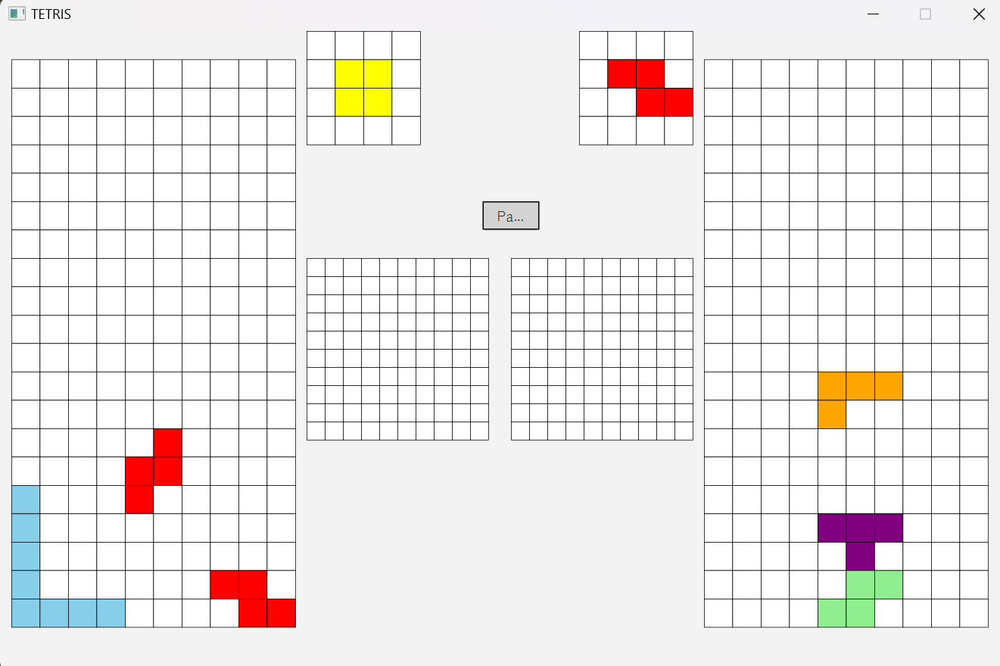

<div align="center">

# TetriJ
> **JavaFx로 만든 테트리스 게임**

</div>


## 프로젝트 정보 
- JavaFx, 3개월 / 4명
- 한 컴퓨터에 최대 2인까지 동시에 테트리스 플레이 가능함 
- 소프트웨어 공학 수업에서 만든 팀프로젝트 
- [시연 영상](https://youtu.be/mJkGdcMPygw)
<table>
  <tr>
    <td></td>
  </tr>
</table>


## 시스템

**게임 플레이**
- 한 줄을 블록으로 다 채우면 그 줄이 사라지는 로직으로 최대한 오래 버티는 게임  
- 아이템 모드 지원 
- 로컬에서 최대 2인 플레이까지 지원


## 담당
### Client 
- 설정화면(색약모드, 키셋팅, 점수계산)을 JSON 형태로 로컬 파일 입출력 관리
- 블록 삭제 애니메이션
- 확률에 따른 블록 생성 유닛테스트 JUNIT을 활용해 제작 

## 파일 구조
```
📦tetrij
┣ 📂Controller   # 메뉴, 설정, 점수 등 UI 컨트롤러 모음 
┣ 📂GameScene    # 인게임(싱글, 멀티) 로직 모음 
┃ ┣ 📂GameSceneMulti
┃ ┣ 📂GameSceneSingle
┃ ┗ 📜GameControllerBase.java
┣ 📂tetromino    # 테트리스 블록, 아이템 클래스 모음
┣ 📜GameManager.java # 게임 전체 매니저
┣ 📜MainMenu.java    # 메인 메뉴
┣ 📜MultiTetris.java # 멀티플레이
┣ 📜PrintTest.java   # 콘솔 테스트용
┣ 📜SingleTetris.java    # 싱글플레이
┗ 📜TetriJ.java  # 프로그램 메인

📦resources/com/snust/tetrij
 ┣ 📂Controller   # FXML 뷰, CSS 모음
 ┣ 📂Font # 게임에서 사용하는 폰트
 ┣ 📂sound    # 효과음, 배경음

📦test
 ┃ ┗ 📂java/com/snust/tetrij
 ┗ ┗ ┗ 📜BlockTest.java # 확률에 따른 블록 생성 유닛테스트
 ```


## 일화

**빌드후 문제 발생**
    
**문제 발생**: 빌드를 했으나 실행 파일에서 키바인딩 설정을 담은 keysetting.json을 읽지 못하는 현상이 발생했습니다. 마감까지 얼마 남지 않았어서 데이터베이스 서버 등으로 설정을 이전할 작업을 할 수 없었습니다.

**문제 원인**: jar 빌드를 할 경우 .exe 파일로 패키징되는데, 실행 파일 내부가 압축된 형태로 묶이면서 내부에 포함된 파일을 직접 읽거나 쓸 수 없었습니다. 

**해결 방법**: 해당 json 파일 경로를 홈디렉토리 경로로 지정하고, 해당 파일이 있으면 read/write를 하지만, 파일이 없다면 생성 후 read/write하도록 바꿨습니다. 이로써 IDE의 로컬 환경과 패키징된 빌드 환경의 파일 시스템 접근 방식에 차이가 있음을 알게되었습니다. 이를 통해 배포 환경을 고려해 조기 빌드 테스트의 중요성을 알게되었습니다.